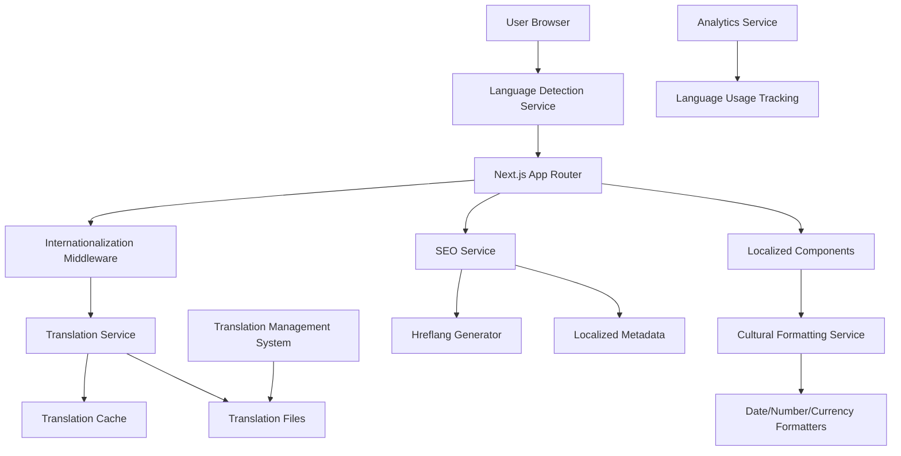

# Design Document

## Overview

This design document outlines the architecture and implementation approach for adding comprehensive multi-language support to the BAOBAB HOPE website. The solution will transform the current bilingual (English/French) system into a scalable, performance-optimized multilingual platform supporting 50+ world languages with proper localization, SEO, and accessibility features.

## Architecture

### High-Level Architecture



### Core Components Architecture

1. **Language Detection Layer**: Browser language detection with fallback logic
2. **Translation Service**: Centralized translation management with caching
3. **Localization Middleware**: Next.js middleware for URL routing and language persistence
4. **Cultural Formatting**: Locale-specific formatting for dates, numbers, currencies
5. **SEO Optimization**: Automated hreflang and metadata generation
6. **Translation Management**: Admin interface for content management
7. **Performance Layer**: Lazy loading and caching strategies

## Components and Interfaces

### 1. Enhanced Language Provider

```typescript
interface LanguageContextType {
  language: string
  availableLanguages: Language[]
  setLanguage: (lang: string) => void
  t: (key: string, params?: Record<string, any>, options?: TranslationOptions) => string
  isLoading: boolean
  direction: 'ltr' | 'rtl'
  locale: string
  formatDate: (date: Date, options?: Intl.DateTimeFormatOptions) => string
  formatNumber: (number: number, options?: Intl.NumberFormatOptions) => string
  formatCurrency: (amount: number, currency: string) => string
}

interface Language {
  code: string
  name: string
  nativeName: string
  direction: 'ltr' | 'rtl'
  region: string
  flag: string
  enabled: boolean
}

interface TranslationOptions {
  fallback?: string
  count?: number
  context?: string
}
```

### 2. Translation Service

```typescript
interface TranslationService {
  loadTranslations(language: string): Promise<TranslationData>
  getTranslation(key: string, language: string, options?: TranslationOptions): string
  preloadLanguages(languages: string[]): Promise<void>
  invalidateCache(language?: string): void
  reportMissingTranslation(key: string, language: string): void
}

interface TranslationData {
  [key: string]: string | TranslationData
}
```

### 3. Language Detection Service

```typescript
interface LanguageDetectionService {
  detectBrowserLanguage(): string
  detectLocationLanguage(): Promise<string>
  getUserPreferredLanguage(): string | null
  setUserPreferredLanguage(language: string): void
  getSupportedLanguage(requestedLanguage: string): string
}
```

### 4. Cultural Formatting Service

```typescript
interface CulturalFormattingService {
  formatDate(date: Date, locale: string, options?: Intl.DateTimeFormatOptions): string
  formatNumber(number: number, locale: string, options?: Intl.NumberFormatOptions): string
  formatCurrency(amount: number, currency: string, locale: string): string
  formatPhoneNumber(phone: string, locale: string): string
  formatAddress(address: Address, locale: string): string
  getLocalizedCurrencies(locale: string): Currency[]
}
```

### 5. Translation Management Interface

```typescript
interface TranslationManagementService {
  getAllTranslations(): Promise<TranslationSet[]>
  updateTranslation(key: string, language: string, value: string): Promise<void>
  bulkImportTranslations(data: TranslationImportData): Promise<void>
  exportTranslations(languages?: string[]): Promise<TranslationExportData>
  getTranslationStatus(): Promise<TranslationStatus>
  approveTranslation(key: string, language: string): Promise<void>
}
```

## Data Models

### Language Configuration

```typescript
interface LanguageConfig {
  code: string // ISO 639-1 code
  name: string // English name
  nativeName: string // Native name
  direction: 'ltr' | 'rtl'
  region: string // Geographic region
  flag: string // Flag emoji or icon
  enabled: boolean
  priority: number // Loading priority
  fallback: string // Fallback language
  pluralRules: PluralRule[]
  dateFormats: DateFormatConfig
  numberFormats: NumberFormatConfig
  currencyFormats: CurrencyFormatConfig
}
```

### Translation Structure

```typescript
interface TranslationFile {
  language: string
  version: string
  lastUpdated: Date
  translations: {
    [namespace: string]: {
      [key: string]: string | PluralTranslation
    }
  }
}

interface PluralTranslation {
  zero?: string
  one: string
  two?: string
  few?: string
  many?: string
  other: string
}
```

### SEO Configuration

```typescript
interface SEOConfig {
  hreflangMapping: Record<string, string>
  defaultLanguage: string
  urlStructure: 'subdirectory' | 'subdomain' | 'parameter'
  canonicalStrategy: 'language-specific' | 'default-language'
  sitemapGeneration: boolean
}
```

## Error Handling

### Translation Error Handling

1. **Missing Translation Keys**:
   - Display fallback language content
   - Log missing keys for translation team
   - Show visual indicator for missing translations in development

2. **Translation File Loading Errors**:
   - Implement retry mechanism with exponential backoff
   - Cache last successful translation set
   - Graceful degradation to English

3. **Language Detection Failures**:
   - Default to English if detection fails
   - Provide manual language selector as backup
   - Log detection failures for analysis

4. **Formatting Errors**:
   - Fallback to basic formatting if locale-specific formatting fails
   - Log formatting errors for debugging
   - Ensure application continues to function

### Error Recovery Strategies

```typescript
interface ErrorRecoveryConfig {
  maxRetries: number
  retryDelay: number
  fallbackLanguage: string
  cacheTimeout: number
  errorReporting: boolean
}
```

## Testing Strategy

### Unit Testing

1. **Translation Service Tests**:
   - Test translation key resolution
   - Test parameter interpolation
   - Test pluralization rules
   - Test fallback mechanisms

2. **Language Detection Tests**:
   - Test browser language detection
   - Test user preference persistence
   - Test fallback logic

3. **Formatting Service Tests**:
   - Test date formatting across locales
   - Test number formatting
   - Test currency formatting
   - Test RTL language support

### Integration Testing

1. **End-to-End Language Switching**:
   - Test complete language switching flow
   - Test URL routing with language codes
   - Test SEO metadata generation

2. **Performance Testing**:
   - Test translation file loading times
   - Test cache effectiveness
   - Test bundle size impact

3. **Accessibility Testing**:
   - Test screen reader compatibility
   - Test keyboard navigation
   - Test high contrast mode

### Localization Testing

1. **RTL Language Testing**:
   - Test Arabic, Hebrew, Persian layouts
   - Test component alignment
   - Test text direction handling

2. **Character Encoding Testing**:
   - Test Unicode character support
   - Test special characters in forms
   - Test font rendering

3. **Cultural Formatting Testing**:
   - Test date formats across cultures
   - Test number separators
   - Test currency symbols

## Performance Considerations

### Bundle Optimization

1. **Code Splitting**:
   - Split translation files by language
   - Lazy load non-critical translations
   - Dynamic imports for language-specific components

2. **Caching Strategy**:
   - Browser cache for translation files
   - Service worker caching
   - CDN distribution for translation assets

3. **Loading Optimization**:
   - Preload critical languages
   - Progressive loading of translations
   - Compression of translation files

### Memory Management

```typescript
interface CacheConfig {
  maxLanguages: number // Maximum languages to keep in memory
  ttl: number // Time to live for cached translations
  compressionEnabled: boolean
  preloadCriticalLanguages: string[]
}
```

## Security Considerations

### Input Validation

1. **Translation Content**:
   - Sanitize user-generated translations
   - Validate translation file integrity
   - Prevent XSS through translation content

2. **Language Code Validation**:
   - Validate language codes against whitelist
   - Prevent path traversal through language parameters
   - Rate limiting for language switching

### Content Security

1. **Translation Management**:
   - Role-based access for translation management
   - Audit trail for translation changes
   - Approval workflow for sensitive content

## Deployment Strategy

### Phased Rollout

1. **Phase 1**: Core Infrastructure
   - Enhanced language provider
   - Translation service
   - Basic language detection

2. **Phase 2**: Extended Language Support
   - Add 20 major world languages
   - Implement RTL support
   - Cultural formatting

3. **Phase 3**: Advanced Features
   - Translation management interface
   - Advanced SEO optimization
   - Analytics and monitoring

4. **Phase 4**: Complete Coverage
   - Remaining 30+ languages
   - Advanced localization features
   - Performance optimizations

### Migration Strategy

1. **Backward Compatibility**:
   - Maintain existing English/French functionality
   - Gradual migration of translation keys
   - Fallback to current system if needed

2. **Content Migration**:
   - Export existing translations
   - Restructure translation files
   - Validate migrated content

## Monitoring and Analytics

### Performance Monitoring

1. **Translation Loading Metrics**:
   - Translation file load times
   - Cache hit rates
   - Error rates by language

2. **User Experience Metrics**:
   - Language switching frequency
   - Page load times by language
   - User engagement by language

### Business Intelligence

1. **Language Usage Analytics**:
   - Most popular languages
   - Geographic distribution
   - Conversion rates by language

2. **Translation Quality Metrics**:
   - Missing translation reports
   - User feedback on translations
   - Translation completion rates

## Accessibility Implementation

### Screen Reader Support

1. **Language Announcements**:
   - Announce language changes
   - Proper lang attributes
   - ARIA labels in user's language

2. **Navigation Support**:
   - Keyboard accessible language selector
   - Focus management during language switching
   - Consistent navigation patterns

### Visual Accessibility

1. **High Contrast Support**:
   - Maintain contrast ratios across languages
   - Proper color coding for language indicators
   - Clear visual hierarchy

2. **Font and Typography**:
   - Appropriate fonts for each script
   - Proper line height and spacing
   - Scalable text across languages